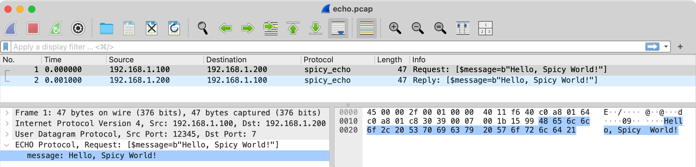

Spicy Wireshark Plugin
======================

This is a Wireshark plugin for writing new dissectors with
[Spicy](https://docs.zeek.org/projects/spicy), a high-level language
for parsing arbitrary protocols. By using Spicy, you can add
new dissectors to Wireshark without needing to write C or Lua code.



Overview
--------

Basic usage is simple: Write a Spicy grammar that describes the
protocol, compile that grammar into a loadable module with Spicy's
compiler, and then have the plugin load that module into Wireshark at
startup. Generally, any Spicy grammar will work, meaning in particular
you can reuse any existing grammars, such as any [that Zeek
uses](https://docs.zeek.org/en/master/devel/spicy/index.html). 

The only additional piece you need is a small addition to each Spicy
grammar that registers a new dissector with Wireshark. We walk through
that in more detail in an example below.

Installation
------------

You need to build the plugin from source as an external plugin that
Wireshark will load at startup. It should generally work on any
platform that Spicy supports, including Linux and macOS, but
currently not Windows.

To build, you need the following prerequisites in place:

- [Wireshark](https://www.wireshark.org) ≥ 4.2, including
  developer headers
  - Note that the development headers often come in a separate
    package, such as `wireshark-dev` on Ubuntu.
- [Spicy](https://docs.zeek.org/projects/spicy) ≥ 1.14 
    - See the [Spicy installation
      instructions](https://docs.zeek.org/projects/spicy/en/latest/installation.html)
      for installation options.
    - You can also [install
      Zeek](https://docs.zeek.org/en/master/install.html), which
      comes with Spicy. You'll need Zeek ≥ 8.0.
- A reasonable modern version of GCC or Clang with C++20 support
- CMake ≥ 3.15

Make sure that both Wireshark's `tshark` and Spicy's compiler `spicyc`
are available in your `PATH`.

Then configure and build the plugin:

```
# ./configure && make && make install
```

This will install the plugin into Wireshark's system-wide plugin
directory. If you now run `tshark -G plugins`, you should see the
Spicy plugin listed in the output.

#### Platform-specific installation notes:

<details>
<summary><tt>Ubuntu 24.04</tt></summary>

```bash
# apt install wireshark wireshark-dev tshark cmake
# curl -LO https://github.com/zeek/spicy/releases/download/v1.14.0/spicy_linux_ubuntu24.deb 
# dpkg --install spicy_linux_ubuntu24.deb

# ./configure --spicy-root=/opt/spicy
# make 
# make install

```

To make the Spicy tools available in your `PATH`, set:

```bash
# export PATH=$PATH:/opt/spicy/bin
```

</details>

<details>
<summary><tt>macOS (with Homebrew)</tt></summary>

Homebrew provides two Wireshark versions: a cask that installs the
full UI version, and a formula that installs only the command-line
tools. The cask unfortunately does not include the development
headers, so you need to install both versions to use the Spicy plugin:

```bash
# brew install wireshark
# brew install wireshark-app

# ./configure --wireshark-use-personal-plugin-dir --wireshark-root="$(brew --prefix wireshark)" 
# make 
# make install
```

The Wireshark application will then be available in the user's
`~/Applications/` folder.

Note that Homebrew's two Wireshark installations (formula and cask),
use different global plugin directories. To work around that, the
`configure` command above specifies
`--wireshark-use-personal-plugin-dir`. That installs the Spicy plugin
into the user's personal plugin directory, which is the same for
both versions.

</details>

#### Optional build customizations:

- If `configure` cannot find the Wireshark installation, you can pass
  it some hints:

  ```
    --wireshark-root=PATH               Override Wireshark root directory
    --wireshark-include-dir=PATH        Override Wireshark include directory
  ```

- Likewise, if `configure` cannot find the Spicy installation:

  ```
    --spicy-root=PATH                   Override Spicy root directory
  ```

- To install the plugin into the user's personal plugin directory,
  instead of system-wide, add `--wireshark-use-personal-plugin-dir`
  to the `configure` command.

Instead of installing the plugin, you can also just point Wireshark
directly to the build directory by setting `WIRESHARK_PLUGIN_DIR`:

```
# export WIRESHARK_PLUGIN_DIR=$(pwd)/build/plugin
```

Example Usage
-------------

Let's create a trivial [UDP
Echo](https://datatracker.ietf.org/doc/html/rfc862) dissector for
Wireshark using Spicy. Here's a Spicy grammar that just parses the
content of entire packets into a single, binary `message` field for
both requests and replies:

```spicy
# File: echo.spicy

module Echo;

import Wireshark;

public type Request = unit { 
    message: bytes &eod; # read all payload until end of data
};

public type Reply = unit { 
    message: bytes &eod;
};

# Let Wireshark know about the dissector.
Wireshark::register_dissector([
    $name = "Echo Protocol",         # long, descriptive dissector name in Wireshark
    $short_name = "spicy_Echo",      # shorthand name for the dissector
    $mode = Wireshark::Mode::Packet, # dissect packets individually (common for UDP protocols)
    $ports = set(7/udp),             # well-known port to recognize the protocol
    $parser_orig = Echo::Request,    # type acting as entry point for client-side packets
    $parser_resp = Echo::Reply       # type acting as entry point for server-side packets
]);
```

While the first part is just a standard Spicy grammar, the
`register_dissector()` call at the end tells Wireshark about our new
dissector. We name it `spicy_Echo` because Wireshark already has a
built-in `Echo` dissector, and short names must be
unique.[^spicy-prefix]

[^spicy-prefix]: Indeed, the plugin automatically prefixes names with
`spicy_` when it finds such a conflict.

We can now compile this Spicy module with:

```
# spicyc -j -L lib/ -Q -o echo.hlto echo.spicy
```

Here, `-j` tells `spicyc` to produce a binary module ready for loading
into Wireshark at runtime. `-L lib/` specifies the directory where the
plugin's `wireshark.spicy` file is located, which is required for the
`import` statement. `-Q` activates offset tracking, which will enable
Wireshark to pinpoint the exact location of parsed fields inside the
packet.

The compilation generates a binary module `echo.hlto`, which is the
compiled dissector that Wireshark can load through the plugin. For
Wireshark to find this at startup, there are two options:

- You can copy the file into a `spicy/` subdirectory inside either
  Wireshark's global or personal plugin directories. The plugin will
  search there for any `*.hlto` files to load as Spicy modules.

- You can set the environment variable
  `WIRESHARK_SPICY_MODULE_PATH` to point to the directory where the
  `*.hlto` file is located. The plugin will search that directory for
  any Spicy modules to load as well.

We'll do the latter here:

```
# export WIRESHARK_SPICY_MODULE_PATH=$(pwd)
```

Now `tshark -G dissectors` should show the new `spicy_Echo` dissector:

```
...
spdy	SPDY
spice	Spice
spicy_Echo	spicy_echo
spnego	SPNEGO
spnego-krb5	SPNEGO-KRB5
...
```

That means we can now use the new dissector in Wireshark. Giving it
the example packet trace in `tests/Traces/`, yields the screenshot at
the top of this page. In `tshark`, it looks like this:

```
# tshark -r tests/Traces/echo.pcap -O spicy_Echo 
Frame 1: 47 bytes on wire (376 bits), 47 bytes captured (376 bits)
Internet Protocol Version 4, Src: 192.168.1.100, Dst: 192.168.1.200
User Datagram Protocol, Src Port: 12345, Dst Port: 7
Echo Protocol, Request: [$message=b"Hello, Spicy World!"]
    message: Hello, Spicy World!

Frame 2: 47 bytes on wire (376 bits), 47 bytes captured (376 bits)
Internet Protocol Version 4, Src: 192.168.1.200, Dst: 192.168.1.100
User Datagram Protocol, Src Port: 7, Dst Port: 12345
Echo Protocol, Reply: [$message=b"Hello, Spicy World!"]
    message: Hello, Spicy World!
```

Customizing the Display
-----------------------

Generally, the Spicy plugin derives the Wireshark tree structure from
the Spicy grammar's unit types. Currently there's only one part of
this process that can be customized: the single-line PDU summary shown
in Wireshark's packet information column. By default, that summary
represents Spicy's `print` output for the unit (that's the
`[$message=b"Hello, Spicy World!"]` in the Echo example). However, if
there's an [on
%print()](https://docs.zeek.org/projects/spicy/en/latest/programming/parsing.html#unit-hooks)
hook defined for the unit, its output will be used instead.


Display Filters
---------------

For use in display filters, the plugin registers all unit fields
reachable from the protocol's entry points with Wireshark. The field
names are generally of the form
`<short_name>.<unit_name>.<field_name>`. For example, in the Echo
dissector, the request's `message` field is accessible as
`spicy_echo.request.message`, and the reply's as
`spicy_echo.reply.message`. 


Dissecting TCP Protocols
------------------------

Dissecting TCP-based protocols is a little bit more involved,
as they typically consist of a series of PDUs split across multiple
TCP segments. To support that, the plugin deploys a slightly different
model, per the following.

For a TCP protocol, when registering a dissector, the `$mode` should be
`Wireshark::Mode::Stream` instead of `Wireshark::Mode::Packet`. This
tells the plugin that the payload of each side of a connection should
be parsed as a single stream of bytes, working with Wireshark's TCP
stream reassembly to reconstruct PDUs from packets as it processes
them.

When using this stream mode, only a single instance of the entry point
unit is used for parsing the *entire stream* in that direction
(whereas packet mode uses a separate instance for each *packet*). As
most protocols consist of a continuous series of PDUs, this usually
then requires a top-level unit that [wraps that sequence of PDUs into
a Spicy vector](https://docs.zeek.org/projects/spicy/en/latest/programming/parsing.html#vector).
This top-level unit is then used as the entry point for the
dissector.[^vector-wrapping]

[^vector-wrapping]: Wrapping a PDU type into a top-level vector is a
common pattern in Spicy grammars, independent of Wireshark. Typically,
one would then also leave out the vector's field name (`requests` in
the example) to facilitate some [code
optimizations](https://docs.zeek.org/projects/spicy/en/latest/programming/parsing.html#anonymous-fields).

For illustration, let's look at a simple example using this approach
for HTTP:

```spicy

module HTTP;

# Entry point for entire stream of all client-side requests.
public type Requests = unit {
    requests:  Request[];
};

# A single HTTP request (i.e., one PDU).
type Request = unit {
    request: RequestLine;           # "GET /index.html HTTP/1.0"
    message: Message(False, True);  # body of the request
};

…

Wireshark::register_dissector([
            …
            $mode = Wireshark::Mode::Stream,
            $parser_orig = HTTP::Requests,
            …
]);
```

One would then add a corresponding `HTTP::Replies` for the server-side
PDUs as well.

This solves the parsing: the dissector will successively process each
HTTP request as it sees it. But there's still a catch: By default,
Wireshark would only display the parsed data at the *end* of the
stream, because that's when the top-level unit has been fully
parsed.[^end-of-stream] For a protocol like HTTP, that's not really
helpful, as we clearly want to see the individual requests as they
arrive. 

[^end-of-stream]: This may be never! Wireshark doesn't reliably flag
the end of a TCP stream to a dissector; and if the plugin doesn't
learn about the end of the stream, it will not show any dissected data
at all by default. So if your TCP-based dissector doesn't seem to
display anything at all, keep reading for how to provide display
hints.

To address this, a dissector needs to provide a little more help: it
needs to tell the Spicy plugin when a PDU is complete and ready for
display. It can do so by implementing a [Spicy
hook](https://docs.zeek.org/projects/spicy/en/latest/programming/parsing.html#unit-hooks)
that calls the plugin-provided function `Wireshark::display(<unit>)`
at the appropriate time, passing it the unit representing the PDU. In
the HTTP example, that would look like this:

```spicy
# Hook that executes each time a request has been fully parsed.
on HTTP::Request() {
    Wireshark::display(self); # tell Wireshark that the request is ready to display
}
```

Note how this decouples the entry point for parsing the TCP stream
(`HTTP::Requests`) from the unit that we'll see associated with
individual packets in Wireshark's output (`HTTP::Request`).

Limitations
-----------

This Wireshark plugin is still very much a work in progress. The main
goal right now is to evaluate the overall feasibility of the approach,
as well as understand what it will take to make it a viable
alternative to writing production dissectors in C or Lua. 

As such, the plugin comes with some limitations for now:

- It currently only supports TCP and UDP protocols. This is not a
  conceptual limitation, the plugin is just lacking ways to register
  other types of dissectors with Wireshark.

- Per above, there are currently only limited options to customize how
  Wireshark displays the parsed fields. Whereas a traditional C or Lua
  dissector has full control over the tree structure, this plugin
  derives the display generically from the protocol's structure. We
  plan to make additional mechanisms available here to customize that
  process.

- There's currently no way to provide textual descriptions for any of
  the dissected fields. We plan to add this by extracting
  documentation strings from Spicy comments that the plugin will then
  channel through to Wireshark.

- The plugin does not yet support Spicy's unit contexts.

- The `tshark` output option `-O <format>` is not yet fully supported. While it
  produces output, some of it is not correct.

Feedback
--------

Feel free to open issues or pull requests for anything you'd like to
see changed. 

License
-------

This Spicy plugin for Wireshark is open source and released under a BSD
license, which allows for pretty much unrestricted use as long as you
leave the license header in place. 
